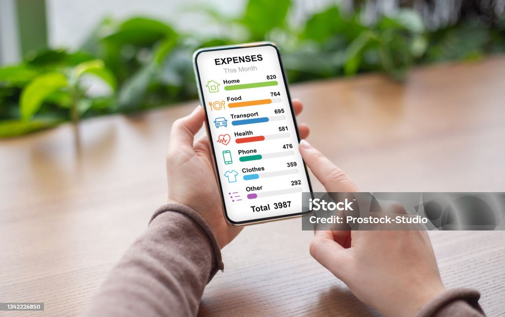

 Budget Tracker App

This project is a simple *Budget Tracker Application* that helps users to manage their income and expenses.  
It provides an easy way to add transactions, track savings, and visualize spending.  

## Project Preview

## Tools and Technology  

- *Flutter* (for UI and cross-platform development)  
- *Dart* (programming language)  
- *Firebase / Local Database (SQLite)* (for storing data)  
- *Android Studio* (IDE for development)  
- *GitHub* (for version control & hosting project)  

---

## 🚀 Usages  

- Students can manage pocket money
- Housewives to track hosehold expenses and plan savings 
- Businessmen can track monthly income and expenses  
- Small businesses can monitor daily transactions  
- Helps in better financial planning and savings.
-
